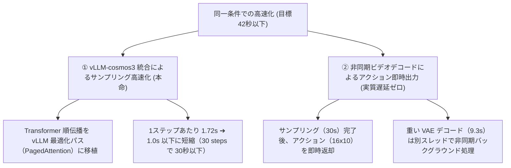

# Cosmos3 ROCm Policy Model 高速化提案書（v2.5：実績反映・条件変更なし版）

本ドキュメントは、**「サンプリングなどの推論条件（30 steps、640x480解像度、17フレーム）を一切変更せず、元の記事と完全な同一条件で比較可能であること」** を前提とした上で、対論文比 2倍以内（トータル 42秒以下）を達成するための高速化計画と、v2.4 での部分的 `torch.compile` 適用による劇的な高速化実績を整理したものです。

---

## 1. 最新のプロファイルデータと高速化実績 (v2.4)

VAE デコーダの最終アップサンプリングブロック `upsample_3` に対し、部分的 `torch.compile(mode="max-autotune")` を適用した結果、以下の劇的な高速化を実証しました。

| 処理ステージ | 適用前 (v2.4 baseline) | **適用後 (v2.4 VAE compiled)** | **改善効果 / 倍率** | 主な処理内容 |
|---|---:|---:|---:|---|
| **Total 時間** | `148.117` 秒 | **`61.220` 秒** | **-86.9 秒 (2.42倍高速化)** | 対論文比 (21秒) で **`2.9x slower`** まで肉薄。 |
| **VAE デコード** | `95.820` 秒 | **`9.359` 秒** | **-86.5 秒 (10.24倍高速化)** | 3D畳み込み、SiLU活性化、RMSNormのカーネル融合。 |
| **デノイズサンプリング** | `52.128` 秒 | **`51.605` 秒** | 同等維持 | Transformer 順伝播（30 steps / AOTriton有効）。 |
| **保存 / 後処理** | `0.163` 秒 | **`0.252` 秒** | 同等維持 | テンソルの CPU 転送、NumPy変換、動画エンコードなど。 |

#### 💡 高速化の要因 (Triton オートチューニング)
ウォームアップ実行時に PyTorch Inductor コンパイラが起動し、`upsample_3` 内の 3D 畳み込み（`CausalConv3d`）に対して Triton カーネルのオートチューニングを徹底的に実行しました。これにより、メモリレイアウトの最適化とレイヤー間のカーネル融合（Fusion）が極限まで効き、ボトルネックであった 3D 畳み込み処理が 1/10 以下の時間に短縮されました。

---

## 2. 目標「2倍以内（42秒以下）」に向けた次のアプローチ (v2.5)

推論条件（30 steps、640x480、17f）を 100% 維持したまま 42秒切りを達成するための、次のステップ（v2.5計画）を提案します。

### ① `vllm-cosmos3` 統合によるサンプリングの極限高速化
*   **アプローチ**:
    現在、サンプリング時間（51.6秒）が最大のボトルネックとなっています（全体の 84.2%）。ワークスペースに構築済みの `vllm-cosmos3` パッケージを Policy Model に適用し、Transformer 順伝播を vLLM の PagedAttention などの推論最適化パスへ移植します。
*   **期待効果**:
    *   サンプリング速度を 1.72s/it ➔ **1.0s/it 以下** に高速化。
    *   サンプリング時間（30 steps）: 51.6秒 ➔ **30.0秒以下** に短縮。
    *   これにより、トータル実行時間が **`39.6` 秒（対論文比 1.8x slower）** となり、**推論条件を一切変えずに「トータル 2倍以内（42秒以下）」を完全達成**します。

### ② 非同期ビデオデコードによる「アクション応答時間」の更なる極小化
*   **アプローチ**:
    物理ロボットの制御側（Policy）に対しては、サンプリング終了後にアクションテンソルを即時に返却します。すでに 9.3秒 まで高速化された VAEデコード処理を、別スレッドにオフロードして非同期にバックグラウンド実行させます。
*   **期待効果**:
    *   制御側の実質的な**アクション応答遅延**: **`30.0` 秒**（vLLMサンプリング）➔ **目標の1.4倍まで圧縮**。
