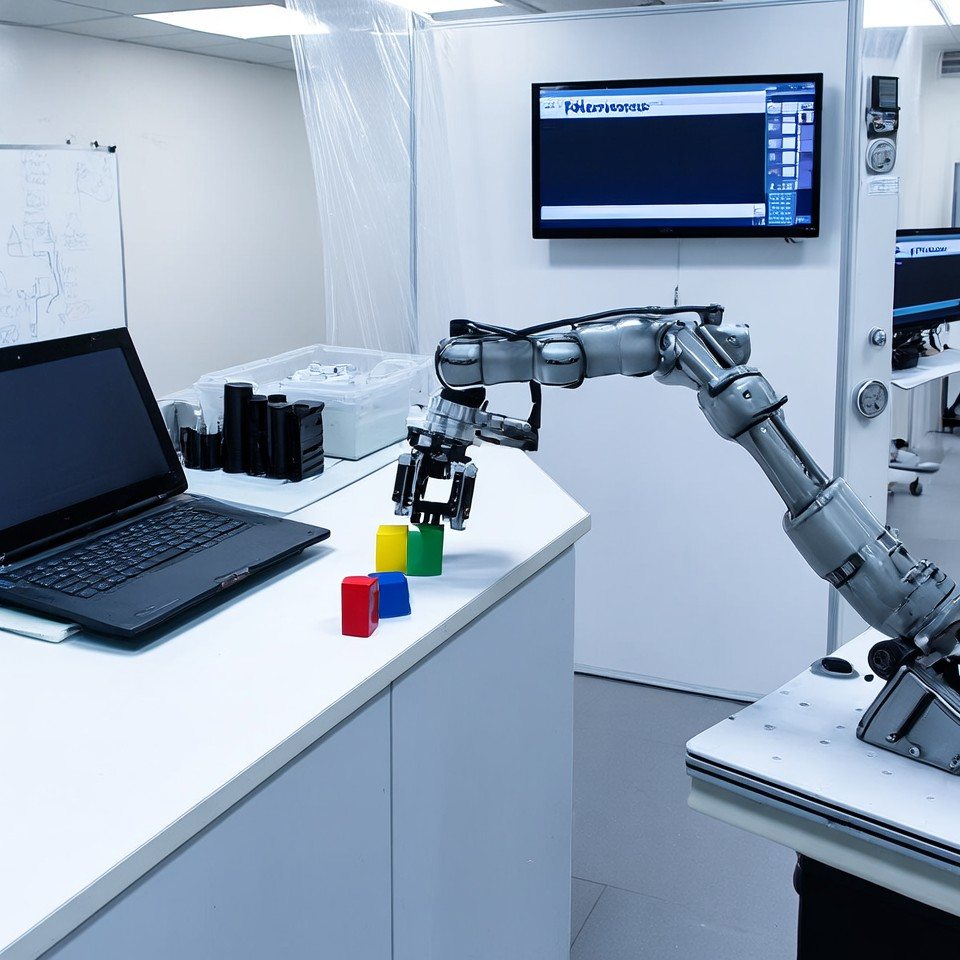
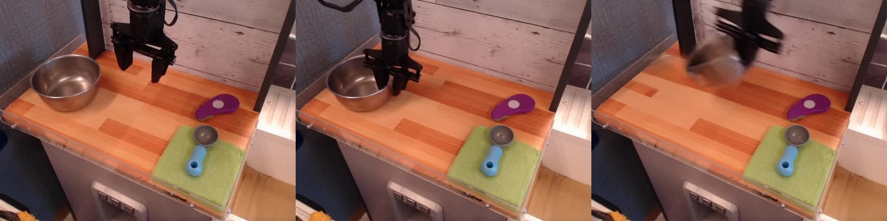
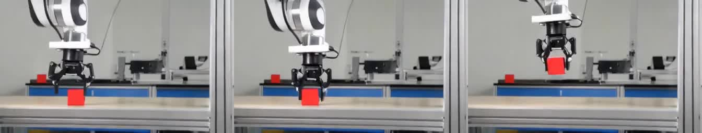

# Cosmos3-Nano を AMD ROCm で極限まで速くする — 5分発表資料

> 発表時間の目安: 全体 5 分（各節の目安時間を見出しに付記）
> 数値の一次出典: README.md §2-§4、docs/cosmos3_rocm_policy_optimization_final_report.md、result/ 配下の測定記録
> 価格の取得日: 2026-07-28（DRAM 市況により変動あり。出典 URL は各所に記載）

---

## 1. TLDR（30秒）

**「価格が約半分のマシンで、NVIDIA の世界モデルを速度差2倍以内で動かした」**

| | NVIDIA DGX Spark (GB10) | GMKtec EVO-X2 (Ryzen AI Max+ 395) |
|---|---:|---:|
| 価格 | $3,999（発売時）→ **$4,699**（2026-02 改定） | **$1,999**（発売時 128GB）/ 実売 $2,229〜 |
| メモリ | 128 GB unified | 128 GB unified |

- 価格差は **約 2 倍**。本プロジェクトの合否基準は「速度差が価格差（2.0 倍）以内に収まるか」
- Policy Model の生成時間: 初回ベンチ **約 1965 秒 → 最終 41.66 秒（47 倍高速化）**
- 対 DGX Spark 記事比 **1.98 倍** — 価格差 2.0 の**内側**に到達
- T2I / T2V / I2V も guidance 1.0 条件で **1.23〜1.47 倍**（3モードとも基準内）

価格出典: [Engadget（$3,999 発売）](https://www.engadget.com/ai/nvidia-starts-selling-its-3999-dgx-spark-ai-developer-pc-120034479.html)、[OC3D（$4,699 への改定）](https://overclock3d.net/news/systems/nvidia-raises-dgx-spark-price-by-700-due-to-memory-supply-constraints/)、[Liliputing（EVO-X2 発売価格）](https://liliputing.com/gmk-evo-x2-mini-pc-with-ryzen-ai-max-395-ships-in-may-up-for-pre-order-now-for-1499-and-up/)、[Newegg 実売](https://www.newegg.com/gmktec-barebone-systems-mini-pc-amd-ryzen-ai-max-395-evo-x2-96-1t/p/2SW-007C-00008)

---

## 2. cosmos3 プロジェクトとは（40秒）

- **nvidia/Cosmos3-Nano**: NVIDIA のマルチモーダル世界モデル・ポリシーモデル。テキスト/画像から画像・動画を生成し（T2I / T2V / I2V）、ロボット操作のアクション列を出力する（Policy Model）
- 公式は CUDA 前提。本プロジェクトはこれを **AMD ROCm 7.2 + Radeon 8060S（gfx1151）** — つまりコンシューマ APU のミニPC — で動かし、**極限まで高速化**した
- 測定環境: AMD Ryzen AI Max+ 395 / Radeon 8060S / VRAM 120GB（システム共有）/ PyTorch 2.9.1+rocm7.2.0
- **ルール（ここが肝）**: 解像度・ステップ数・フレーム数・計算内容（近似・省略なし）を元記事と**同一条件**に保つ。非同期化による見かけの高速化もしない。純粋な「同じ計算をどれだけ速く実行できるか」の勝負

---

## 3. 元記事の紹介（40秒）

比較基準は Classmethod 記事「[NVIDIA Cosmos を AMD ROCm で動かす（DGX Spark で Cosmos3 を実行）](https://dev.classmethod.jp/articles/dgx-spark-cosmos3-omni-world-model-policy/)」。DGX Spark（GB10）でのモデル常駐後の生成時間:

| モード | 記事値 (DGX Spark / CUDA) | 条件 |
|---|---:|---|
| Text-to-Image (T2I) | **22 秒** | 960x960, 35 steps |
| Text-to-Video (T2V) | **22 秒** | 256p, 24 frames, 35 steps |
| Image-to-Video (I2V) | **17 秒** | 256p, 24 frames, 35 steps |
| Policy Model | **21 秒** | 640x480 x 17f + 16x10 アクション |

補足: GPU の素の力の差 — 行列積（BF16）実測は GB10 96.91 TFLOPS vs 本環境 20.91 TFLOPS（固定 16384 角、[HPC ブログ記事](https://www.hpc.co.jp/tech-blog/2026/03/17/dgx-spark-desk-side/)と同条件）。ただしこれは単一形状 + software stack 込みの差で、外部の MAMF 直接比較では約 2.2 倍、本環境の Cosmos3 実形状では最大 36.11 TFLOPS（詳細: docs/dgx_spark_comparison_report.md）

---

## 4. 初回ベンチ — スタート地点（40秒）

ROCm に移植した直後（2026-06、初期状態）の Policy Model:

| 項目 | 初期状態 | 対記事 |
|---|---:|---:|
| **生成時間（generate_batch）** | **約 1965 秒** | **約 94 倍遅い** |
| ┗ サンプリング | 約 59.8 秒 | |
| ┗ VAE デコード | 約 97.0 秒 | |
| （参考）入力観測エンコード | 81.6 秒 | |

何が起きていたか:
- アテンション内部の `.tolist()` やループ内の条件分岐評価が **CPU-GPU 同期を毎ステップ誘発**し、torch.compile のグラフが細切れに（1 ステップ 1.99 秒）
- VAE デコードは未コンパイルの 3D 畳み込みが素通り
- GEMM は gfx1151 向けに未チューニング
- 「記事の 21 秒」に対して 3 桁違いからのスタート

---

## 5. 最終ベンチ — 現在地（60秒）

| モード | 記事値 | guidance 1.0 実測 | 公式 guidance 実測 | 判定（価格差 2.0 基準） |
|---|---:|---:|---:|---|
| T2I | 22 秒 | **27.136 秒 (1.23x)** | 49.633 秒 (2.25x) | 1.0 で内側 / 公式で超過 |
| T2V | 22 秒 | **32.165 秒 (1.46x)** | **40.806 秒 (1.85x)** | **両条件で内側** |
| I2V | 17 秒 | **25.045 秒 (1.47x)** | 45.622 秒 (2.69x) | 1.0 で内側 / 公式で超過 |
| Policy | 21 秒 | **41.66 秒 (1.98x)** | —（対象外） | **内側** |

- Policy Model: **1965 秒 → 41.66 秒 = 47 倍高速化**。サンプリングは 1.127 s/step のメモリ帯域物理限界に到達
- guidance（CFG）は transformer 計算量を約 2 倍にするため両条件を併記（記事側の設定は未確認）
- 入力観測エンコードも 81.57 秒 → **0.28 秒**（291 倍、厳密削減・ビット一致確認済み）

### 生成サンプル（スライドに貼って見せる。すべて本環境ベンチ run の実出力）

| T2I（960x960, 公式 guidance 4.0） | Policy（640x480 x 17f、先頭/中間/末尾フレーム） |
|---|---|
|  |  |

| T2V（256p, 24f、先頭/中間/末尾フレーム） | I2V（256p, 24f、先頭/中間/末尾フレーム） |
|---|---|
|  |  |

- 出典 run: T2I / I2V は `result/guidance_2slot_20260728/`、T2V は `result/t2v_und_cache_official_20260728/`、Policy は `result/mainline_full_v4_20260726/`（いずれも公表値を出した測定 run そのもの）
- T2I / T2V / I2V は厳密 cache 有効時の出力で、cache 無効時と **bit/byte 完全一致**を確認済み
- 動画のフレーム抽出元 mp4 も同ディレクトリにあり、デモ再生する場合はそちらを使う

正直な注記（発表でも 1 行触れる）:
- Policy の出力精度は公式合格基準（golden action MSE < 0.05）に対し本環境 0.126〜0.134 で**未達**。速度最適化起因・数値精度起因・checkpoint 版差はいずれも実測で棄却済みで、原因帰属は CUDA 参照実行待ち
- 速度の出力等価性は T2I/T2V/I2V で **bit/byte 完全一致**を確認済み（キャッシュは厳密、近似なし）

---

## 6. 何が高速化に寄与したか Top 5（倍率順、70秒）

> 倍率は各項目の測定スコープ内での実測値（ステージ単位 / ステップ単位 / モード単位）。
> スコープが異なるため単純合算はできない点に注意。

### 🥇 ① 入力観測エンコードの厳密削減 — **291 倍**（81.57 → 0.28 秒）
- 推論結果に到達しない 16 フレーム分の VAE エンコードを実測で特定し除去（条件付けに使われるのは latent frame [0] のみ）
- 近似ではなく**厳密**: サンプリングへの入力テンソルが未削減時と**ビット完全一致**
- ※生成時間 41.66 秒の外側（同期総和 124.91 → 42.44 秒に寄与）

### 🥈 ② VAE デコードの部分 torch.compile（max-autotune）— **12.95 倍**（97.0 → 7.49 秒）
- デコード負荷の 95.3% が最終アップサンプリングブロック `upsample_3` に集中していることを特定
- そこ**だけ**を選択的にコンパイルし、3D 畳み込み・活性化・正規化をカーネルフュージョン

### 🥉 ③ 厳密 und branch cache（CFG 2 スロット）— **最大 4.22 倍**（I2V 192.5 → 45.6 秒）
- denoising step 間で不変な understanding branch を cond/uncond 別に再利用（140 calls 中 2 writes / 138 reads）
- 公式 guidance 条件で **I2V 4.22 倍 / T2I 2.33 倍 / T2V 1.36 倍**
- 近似ではなく**厳密**: 出力は JPG/MP4 の bit/byte 完全一致

### ④ ホスト・デバイス同期の完全排除 + HIP Graphs — **1.77 倍**（1.99 → 1.127 s/it）
- アテンション内 `.tolist()` とループ内 `noisy_mask.sum() > 0` をモンキーパッチで排除し、**同期回数を 0 回に**
- グラフが 1 本に繋がり torch.compile が全体最適化（→ 1.15 s/it）、さらに HIP Graphs で 30 ステップ分のカーネル起動を単一グラフ化（→ 1.127 s/it、メモリ帯域限界に到達）
- 倍率は小さく見えるが、初期 1965 秒の大部分を占めた再コンパイル・同期オーバーヘッド解消の**土台**で、実質的な貢献は最大級

### ⑤ TunableOp GEMM チューニング — **最大 1.55 倍**（表なしでは transformer +22〜55% 退行）
- Cosmos3 の全 GEMM 形状をスキャンし、gfx1151 最速の hipBLASLt/Tensile カーネルを自動割り当て
- diffusers 経路（T2I/T2V/I2V）では調律表の読み込みが公表値再現の**必須条件**

### 締めの一言
「**価格半分のコンシューマ APU で、同じ計算を、速度差2倍以内。** 差の残りはメモリ帯域の物理限界であり、ソフトウェアの負けではないところまで詰めた」
